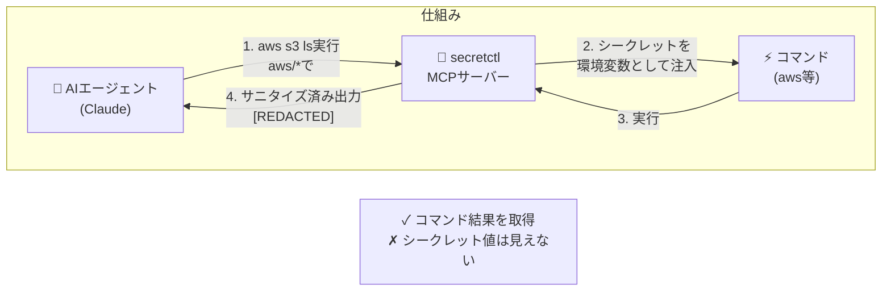
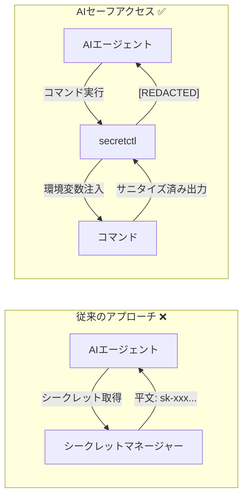

# secretctl

<p align="center">
  <a href="README.md">
    
  </a>
  <a href="README-ja.md">
    
  </a>
</p>

**最もシンプルなAI対応シークレットマネージャー**

インフラ不要。サブスクリプション不要。複雑さ不要。

[](https://go.dev/)
[](LICENSE)
[](https://forest6511.github.io/secretctl/ja/)
[](https://codecov.io/gh/forest6511/secretctl)


---

## なぜ secretctl？

シークレット管理にDevOpsの博士号は必要ありません。secretctlはローカルファーストのシークレットマネージャーです：

- **すぐに使える** — シングルバイナリ、サーバー不要、設定ファイル不要
- **ローカルで完結** — シークレットはあなたのマシンから出ることがありません
- **AIと共存** — AIコーディングアシスタント時代に設計（MCP対応）
- **ワークフローを尊重** — CLI優先 + デスクトップアプリ

```
# これだけで完了。
secretctl init
secretctl set API_KEY
secretctl get API_KEY
```

### なぜローカルファースト＆AIセーフ？

1. **あなたのシークレット、あなたのマシン** — クラウド同期なし、第三者サーバーなし、サブスクリプション料金なし。認証情報はあなたのデバイスに留まります。

2. **AIエージェントに平文は不要** — Claudeが`aws s3 ls`を実行する時、必要なのは*結果*であって、AWSキーではありません。secretctlはコマンドに直接認証情報を注入します—AIはシークレットを見ることがありません。

3. **多層防御** — AES-256-GCM暗号化、Argon2idキー導出、MCPポリシー制御、自動出力サニタイズ。単一障害点ではなく、複数のレイヤーで保護。



## インストール

### ソースから

```bash
# Go 1.24+ が必要
git clone https://github.com/forest6511/secretctl.git
cd secretctl
go build -o secretctl ./cmd/secretctl
```

### バイナリリリース

最新リリースは [GitHub Releases](https://github.com/forest6511/secretctl/releases) からダウンロードできます。

**CLI:**
- `secretctl-linux-amd64` — Linux (x86_64)
- `secretctl-linux-arm64` — Linux (ARM64)
- `secretctl-darwin-amd64` — macOS (Intel)
- `secretctl-darwin-arm64` — macOS (Apple Silicon)
- `secretctl-windows-amd64.exe` — Windows (x86_64)

**デスクトップアプリ:**
- `secretctl-desktop-macos` — macOS (Universal)
- `secretctl-desktop-linux` — Linux (AppImage)
- `secretctl-desktop-windows.exe` — Windows (Installer)

#### ダウンロードの検証

```bash
# checksums.txt をダウンロードして検証
sha256sum -c checksums.txt
```

#### macOS: Gatekeeper警告

macOSは署名されていないアプリに対してセキュリティ警告を表示することがあります。許可するには：

```bash
# オプション1: 隔離属性を削除
xattr -d com.apple.quarantine secretctl-darwin-arm64

# オプション2: アプリを右クリックして「開く」を選択
```

#### Windows: SmartScreen警告

Windows SmartScreenが警告を表示することがあります。許可するには：

1. 「詳細情報」をクリック
2. 「実行」をクリック

## クイックスタート

### 1. Vaultを初期化

```bash
secretctl init
# マスターパスワードを入力（8文字以上）
```

### 2. シークレットを保存

```bash
echo "sk-your-api-key" | secretctl set OPENAI_API_KEY
```

### 3. シークレットを取得

```bash
secretctl get OPENAI_API_KEY
```

### 4. すべてのシークレットを一覧表示

```bash
secretctl list
```

### 5. シークレットを削除

```bash
secretctl delete OPENAI_API_KEY
```

## 機能

### コア機能

- **AES-256-GCM暗号化** — 業界標準の認証付き暗号化
- **Argon2idキー導出** — ブルートフォース攻撃に対するメモリハード保護
- **SQLiteストレージ** — 信頼性が高く、ポータブル、外部依存なし
- **監査ログ** — 改ざん検出のためのHMACチェーン付きログ
- **AIセーフ設計** — MCP統合でAIエージェントに平文シークレットを公開しない

### メタデータサポート

```bash
# シークレットにメモとタグを追加
secretctl set DB_PASSWORD --notes="本番データベース" --tags="prod,db"

# URL参照を追加
secretctl set API_KEY --url="https://console.example.com/api-keys"

# 有効期限を設定
secretctl set TEMP_TOKEN --expires="30d"

# タグでフィルター
secretctl list --tag=prod

# 期限切れ間近のシークレットを表示
secretctl list --expiring=7d

# フルメタデータを表示
secretctl get API_KEY --show-metadata
```

### シークレットでコマンド実行

シェル履歴に公開せずにシークレットを環境変数として注入：

```bash
# 単一のシークレットでコマンド実行
secretctl run -k API_KEY -- curl -H "Authorization: Bearer $API_KEY" https://api.example.com

# ワイルドカードで複数のシークレットを注入
# パターン aws/* は aws/access_key, aws/secret_key にマッチ（単一レベル）
secretctl run -k "aws/*" -- aws s3 ls

# 出力は自動的にサニタイズされシークレット漏洩を防止
secretctl run -k DB_PASSWORD -- ./deploy.sh
# deploy.shがDB_PASSWORDを出力すると [REDACTED:DB_PASSWORD] として表示

# タイムアウトとプレフィックス付き
secretctl run -k API_KEY --timeout=30s --env-prefix=APP_ -- ./app
```

> **注意**: 出力サニタイズは完全一致を使用します。エンコードされたシークレット（Base64、hex）や部分一致は検出されません。

### シークレットのエクスポート

Docker、CI/CD、その他のツールで使用するためにシークレットをエクスポート：

```bash
# .envファイルとしてエクスポート（デフォルト）
secretctl export -o .env

# 特定のキーをJSONとしてエクスポート
secretctl export --format=json -k "db/*" -o config.json

# パイプ用にstdoutにエクスポート
secretctl export --format=json | jq '.DB_HOST'
```

### シークレットのインポート

既存の`.env`またはJSONファイルからシークレットをインポート：

```bash
# .envファイルからインポート
secretctl import .env

# JSONファイルからインポート
secretctl import config.json

# インポート内容をプレビュー（ドライラン）
secretctl import .env --dry-run

# 競合処理: スキップ、上書き、またはエラー
secretctl import .env --on-conflict=skip
secretctl import .env --on-conflict=overwrite
```

### パスワード生成

安全なランダムパスワードを生成：

```bash
# 24文字のパスワードを生成（デフォルト）
secretctl generate

# 記号なしの32文字パスワードを生成
secretctl generate -l 32 --no-symbols

# 複数のパスワードを生成
secretctl generate -n 5
```

### バックアップとリストア

暗号化バックアップを作成しVaultをリストア：

```bash
# 暗号化バックアップを作成
secretctl backup -o vault-backup.enc

# 監査ログ付きでバックアップを作成
secretctl backup -o full-backup.enc --with-audit

# バックアップの整合性を検証
secretctl restore vault-backup.enc --verify-only

# 新しいVaultにリストア（まずドライラン）
secretctl restore vault-backup.enc --dry-run

# 競合処理付きでリストア
secretctl restore vault-backup.enc --on-conflict=skip    # 既存キーをスキップ
secretctl restore vault-backup.enc --on-conflict=overwrite  # 既存を上書き

# パスワードの代わりにキーファイルを使用（自動化用）
secretctl backup -o backup.enc --key-file=backup.key
secretctl restore backup.enc --key-file=backup.key
```

> **セキュリティ**: バックアップは新しいソルトを使用したAES-256-GCMで暗号化されます。HMAC-SHA256整合性チェックで改ざんを検出します。

### 監査ログ

```bash
# 最近の監査イベントを表示
secretctl audit list --limit=50

# ログの整合性を検証
secretctl audit verify

# 監査ログをエクスポート
secretctl audit export --format=csv -o audit.csv

# 古いログを削除（まずプレビュー）
secretctl audit prune --older-than=12m --dry-run
```

### AIセーフアクセス

secretctlは**AIセーフアクセス**を実装しています — AIエージェントが平文シークレットを受け取ることがないセキュリティ原則です。

従来のシークレットマネージャーがAIに直接認証情報を公開する可能性があるのとは異なり、secretctlは根本的に異なるアプローチを使用します：



これは1PasswordやHashiCorp Vaultなどの業界リーダーが使用する**「公開なしアクセス」**哲学に従っています。

### AI統合（MCPサーバー）

secretctlにはClaude CodeなどのAIコーディングアシスタントとの安全な統合のためのMCPサーバーが含まれています：

```bash
# MCPサーバーを起動（SECRETCTL_PASSWORDが必要）
SECRETCTL_PASSWORD=your-password secretctl mcp-server
```

**利用可能なMCPツール:**
- `secret_list` — メタデータ付きでシークレットキーを一覧表示（値は公開されない）
- `secret_exists` — メタデータ付きでシークレットの存在を確認
- `secret_get_masked` — マスクされた値を取得（例：`****WXYZ`）
- `secret_run` — 環境変数としてシークレットを注入してコマンド実行
- `secret_list_fields` — マルチフィールドシークレットのフィールド名を一覧表示（値なし）
- `secret_get_field` — 非機密フィールドの値のみ取得
- `secret_run_with_bindings` — 事前定義された環境バインディングで実行

**Claude Codeでの設定** (`~/.claude.json`):
```json
{
  "mcpServers": {
    "secretctl": {
      "command": "/path/to/secretctl",
      "args": ["mcp-server"],
      "env": {
        "SECRETCTL_PASSWORD": "your-master-password"
      }
    }
  }
}
```

**ポリシー設定** (`~/.secretctl/mcp-policy.yaml`):
```yaml
version: 1
default_action: deny
allowed_commands:
  - aws
  - gcloud
  - kubectl
```

> **セキュリティ**: AIエージェントは平文シークレットを受け取りません。`secret_run`ツールはシークレットを環境変数として注入し、出力は自動的にサニタイズされます。

### デスクトップアプリ

secretctlにはWails v2で構築されたネイティブデスクトップアプリケーションが含まれています：


*テンプレート付きマルチフィールドシークレット（データベース、APIキー、ログイン、SSHキー）を表示するデスクトップアプリ*

```bash
# デスクトップアプリをビルド
cd desktop && wails build

# または開発モードで実行
cd desktop && wails dev
```

**機能:**
- ネイティブmacOS/Windows/Linuxアプリケーション
- マスターパスワードでVaultを作成・アンロック
- 完全なシークレットCRUD操作（作成、読取、更新、削除）
- キーでシークレットを検索・フィルター
- シークレット値をクリップボードにコピー（自動クリア付き）
- メタデータサポート（URL、タグ、メモ）
- パスワード表示切り替え
- アイドルタイムアウト時の自動ロック
- **監査ログビューア** — すべてのVaultアクティビティを表示・分析
  - アクション、ソース、キー、日付範囲でフィルター
  - 大量ログ用のページネーション
  - チェーン整合性検証
  - CSV/JSON形式でエクスポート
  - 詳細ログエントリモーダル
- モダンなReact + TypeScript + Tailwind CSSフロントエンド

**開発:**
```bash
# E2Eテストを実行（Playwright）
cd desktop/frontend
npm run test:e2e

# ブラウザ表示付きで実行
npm run test:e2e:headed

# Playwright UIで実行
npm run test:e2e:ui
```

## セキュリティ

secretctlはセキュリティを真剣に考えています：

- **ゼロ知識設計** — マスターパスワードは保存・送信されません
- **AES-256-GCM暗号化** — 業界標準の認証付き暗号化
- **Argon2idキー導出** — ブルートフォースに対するメモリハード保護
- **安全なファイルパーミッション** — Vaultファイルは0600パーミッションで作成
- **ネットワークアクセスなし** — 完全オフライン動作
- **改ざん検出ログ** — HMACチェーンでログ操作を検出
- **出力サニタイズ** — コマンド出力でシークレットを自動リダクト

セキュリティ脆弱性の報告については、[SECURITY.md](SECURITY.md)をご覧ください。

## ドキュメント

📚 **[完全なドキュメント](https://forest6511.github.io/secretctl/ja/)** — 入門、ガイド、リファレンス

- [はじめに](https://forest6511.github.io/secretctl/ja/docs/getting-started/) - インストールとクイックスタート
- [CLIガイド](https://forest6511.github.io/secretctl/ja/docs/guides/cli/) - コマンドライン使用法
- [MCP統合](https://forest6511.github.io/secretctl/ja/docs/guides/mcp/) - AIエージェント統合
- [デスクトップアプリ](https://forest6511.github.io/secretctl/ja/docs/guides/desktop/) - ネイティブアプリケーションガイド
- [コントリビューションガイド](CONTRIBUTING.md)
- [セキュリティポリシー](SECURITY.md)

## ライセンス

Apache License 2.0 — 詳細は[LICENSE](LICENSE)をご覧ください。

---

シンプルさとセキュリティを重視する開発者のために心を込めて作りました。
