# secretctl

<p align="center">
  <a href="README.md">
    
  </a>
  <a href="README-ja.md">
    
  </a>
</p>

**Stop pasting API keys into AI chat.**

When you paste `sk-proj-xxx` into Claude Code, that secret is now in your conversation history, Anthropic's logs, and potentially exposed to prompt injection attacks.

secretctl fixes this. Your AI gets command results, never secret values.

[](https://go.dev/)
[](LICENSE)
[](https://forest6511.github.io/secretctl/)
[](https://codecov.io/gh/forest6511/secretctl)


---

## The Problem

Every day, developers paste secrets into AI coding assistants:

```
You: "Help me debug this AWS error"
You: "Here's my config: AWS_ACCESS_KEY_ID=AKIA..."
```

**This is a security incident waiting to happen.**

- Secrets in conversation history
- Secrets in cloud logs
- Secrets exposed to prompt injection
- No way to rotate or revoke

## The Solution

secretctl injects secrets as environment variables. Your AI runs commands and sees results, but **never sees the actual credentials**.

- **Single binary** — No servers, no configuration, no subscription
- **Local-first** — Secrets never leave your machine
- **MCP integration** — Works with Claude Code out of the box
- **Defense in depth** — AES-256-GCM + Argon2id + output sanitization

```
# That's it. You're done.
secretctl init
secretctl set API_KEY
secretctl get API_KEY
```

### Why Local-First & AI-Safe?

1. **Your secrets, your machine** — No cloud sync, no third-party servers, no subscription fees. Your credentials stay on your device, period.

2. **AI agents don't need plaintext** — When Claude runs `aws s3 ls`, it needs the *result*, not your AWS keys. secretctl injects credentials directly into commands—AI never sees them.

3. **Defense in depth** — AES-256-GCM encryption at rest, Argon2id key derivation, MCP policy controls, and automatic output sanitization. Multiple layers, not a single point of failure.

```mermaid
flowchart LR
    subgraph Flow["How It Works"]
        AI["🤖 AI Agent<br/>(Claude)"]
        MCP["🔐 secretctl<br/>MCP Server"]
        CMD["⚡ Command<br/>(aws, etc)"]

        AI -->|"1. Run aws s3 ls<br/>with aws/*"| MCP
        MCP -->|"2. Inject secrets<br/>as env vars"| CMD
        CMD -->|"3. Execute"| MCP
        MCP -->|"4. Sanitized output<br/>[REDACTED]"| AI
    end

    AI ~~~ NOTE["✓ Gets command results<br/>✗ Never sees secret values"]
```



## Installation

### From Source

```bash
# Requires Go 1.24+
git clone https://github.com/forest6511/secretctl.git
cd secretctl
go build -o secretctl ./cmd/secretctl
```

### Binary Releases

Download the latest release from [GitHub Releases](https://github.com/forest6511/secretctl/releases).

**CLI:**
- `secretctl-linux-amd64` — Linux (x86_64)
- `secretctl-linux-arm64` — Linux (ARM64)
- `secretctl-darwin-amd64` — macOS (Intel)
- `secretctl-darwin-arm64` — macOS (Apple Silicon)
- `secretctl-windows-amd64.exe` — Windows (x86_64)

**Desktop App:**
- `secretctl-desktop-macos` — macOS (Universal)
- `secretctl-desktop-linux` — Linux (AppImage)
- `secretctl-desktop-windows.exe` — Windows (Installer)

#### Verify Downloads

```bash
# Download checksums.txt and verify
sha256sum -c checksums.txt
```

#### macOS: Gatekeeper Warning

macOS may show a security warning for unsigned apps. To allow:

```bash
# Option 1: Remove quarantine attribute
xattr -d com.apple.quarantine secretctl-darwin-arm64

# Option 2: Right-click the app and select "Open"
```

#### Windows: SmartScreen Warning

Windows SmartScreen may show a warning. To allow:

1. Click "More info"
2. Click "Run anyway"

## Quick Start

### 1. Initialize your vault

```bash
secretctl init
# Enter your master password (min 8 characters)
```

### 2. Store a secret

```bash
echo "sk-your-api-key" | secretctl set OPENAI_API_KEY
```

### 3. Retrieve a secret

```bash
secretctl get OPENAI_API_KEY
```

### 4. List all secrets

```bash
secretctl list
```

### 5. Delete a secret

```bash
secretctl delete OPENAI_API_KEY
```

## Features

### Core

- **AES-256-GCM encryption** — Industry-standard authenticated encryption
- **Argon2id key derivation** — Memory-hard protection against brute force
- **SQLite storage** — Reliable, portable, no external dependencies
- **Audit logging** — HMAC-chained logs for tamper detection
- **AI-safe by design** — MCP integration never exposes plaintext secrets to AI agents

### Metadata Support

```bash
# Add notes and tags to secrets
secretctl set DB_PASSWORD --notes="Production database" --tags="prod,db"

# Add URL reference
secretctl set API_KEY --url="https://console.example.com/api-keys"

# Set expiration
secretctl set TEMP_TOKEN --expires="30d"

# Filter by tag
secretctl list --tag=prod

# Show expiring secrets
secretctl list --expiring=7d

# View full metadata
secretctl get API_KEY --show-metadata
```

### Run Commands with Secrets

Inject secrets as environment variables without exposing them in your shell history:

```bash
# Run a command with a single secret
secretctl run -k API_KEY -- curl -H "Authorization: Bearer $API_KEY" https://api.example.com

# Use wildcards to inject multiple secrets
# Pattern aws/* matches aws/access_key, aws/secret_key (single level)
secretctl run -k "aws/*" -- aws s3 ls

# Output is automatically sanitized to prevent secret leakage
secretctl run -k DB_PASSWORD -- ./deploy.sh
# If deploy.sh prints DB_PASSWORD, it appears as [REDACTED:DB_PASSWORD]

# With timeout and prefix
secretctl run -k API_KEY --timeout=30s --env-prefix=APP_ -- ./app
```

> **Note**: Output sanitization uses exact string matching. Encoded secrets (Base64, hex) or partial matches are not detected.

### Export Secrets

Export secrets for use with Docker, CI/CD, or other tools:

```bash
# Export as .env file (default)
secretctl export -o .env

# Export specific keys as JSON
secretctl export --format=json -k "db/*" -o config.json

# Export to stdout for piping
secretctl export --format=json | jq '.DB_HOST'
```

### Import Secrets

Import secrets from existing `.env` or JSON files:

```bash
# Import from .env file
secretctl import .env

# Import from JSON file
secretctl import config.json

# Preview what would be imported (dry run)
secretctl import .env --dry-run

# Handle conflicts: skip, overwrite, or error
secretctl import .env --on-conflict=skip
secretctl import .env --on-conflict=overwrite
```

### Generate Passwords

Create secure random passwords:

```bash
# Generate a 24-character password (default)
secretctl generate

# Generate a 32-character password without symbols
secretctl generate -l 32 --no-symbols

# Generate multiple passwords
secretctl generate -n 5
```

### Backup and Restore

Create encrypted backups and restore your vault:

```bash
# Create encrypted backup
secretctl backup -o vault-backup.enc

# Create backup with audit logs
secretctl backup -o full-backup.enc --with-audit

# Verify backup integrity
secretctl restore vault-backup.enc --verify-only

# Restore to a new vault (dry run first)
secretctl restore vault-backup.enc --dry-run

# Restore with conflict handling
secretctl restore vault-backup.enc --on-conflict=skip    # Skip existing keys
secretctl restore vault-backup.enc --on-conflict=overwrite  # Overwrite existing

# Use key file instead of password (for automation)
secretctl backup -o backup.enc --key-file=backup.key
secretctl restore backup.enc --key-file=backup.key
```

> **Security**: Backups are encrypted with AES-256-GCM using a fresh salt. The HMAC-SHA256 integrity check detects any tampering.

### Audit Log

```bash
# View recent audit events
secretctl audit list --limit=50

# Verify log integrity
secretctl audit verify

# Export audit logs
secretctl audit export --format=csv -o audit.csv

# Prune old logs (preview first)
secretctl audit prune --older-than=12m --dry-run
```

### AI-Safe Access

secretctl implements **AI-Safe Access** — a security principle where AI agents never receive plaintext secrets.

Unlike traditional secret managers that might expose credentials directly to AI, secretctl uses a fundamentally different approach:

```mermaid
flowchart LR
    subgraph "Traditional Approach ❌"
        AI1[AI Agent] -->|"get secret"| SM1[Secret Manager]
        SM1 -->|"plaintext: sk-xxx..."| AI1
    end

    subgraph "AI-Safe Access ✅"
        AI2[AI Agent] -->|"run command"| SM2[secretctl]
        SM2 -->|"inject env vars"| CMD[Command]
        CMD -->|"sanitized output"| SM2
        SM2 -->|"[REDACTED]"| AI2
    end
```



This follows the **"Access Without Exposure"** philosophy used by industry leaders like 1Password and HashiCorp Vault.

### AI Integration (MCP Server)

secretctl includes an MCP server for secure integration with AI coding assistants like Claude Code:

```bash
# Start MCP server (requires SECRETCTL_PASSWORD)
SECRETCTL_PASSWORD=your-password secretctl mcp-server
```

**Available MCP Tools:**
- `secret_list` — List secret keys with metadata (no values exposed)
- `secret_exists` — Check if a secret exists with metadata
- `secret_get_masked` — Get masked value (e.g., `****WXYZ`)
- `secret_run` — Execute commands with secrets as environment variables
- `secret_list_fields` — List field names for multi-field secrets (no values)
- `secret_get_field` — Get non-sensitive field values only
- `secret_run_with_bindings` — Execute with predefined environment bindings

**Configure in Claude Code** (`~/.claude.json`):
```json
{
  "mcpServers": {
    "secretctl": {
      "command": "/path/to/secretctl",
      "args": ["mcp-server"],
      "env": {
        "SECRETCTL_PASSWORD": "your-master-password"
      }
    }
  }
}
```

**Policy Configuration** (`~/.secretctl/mcp-policy.yaml`):
```yaml
version: 1
default_action: deny
allowed_commands:
  - aws
  - gcloud
  - kubectl
```

> **Security**: AI agents never receive plaintext secrets. The `secret_run` tool injects secrets as environment variables, and output is automatically sanitized.

### Desktop App

secretctl includes a native desktop application built with Wails v2:


*Desktop app showing multi-field secrets with templates (Database, API Key, Login, SSH Key)*

```bash
# Build the desktop app
cd desktop && wails build

# Or run in development mode
cd desktop && wails dev
```

**Features:**
- Native macOS/Windows/Linux application
- Create and unlock vaults with master password
- Full secret CRUD operations (Create, Read, Update, Delete)
- Search and filter secrets by key
- Copy secret values to clipboard (with auto-clear)
- Metadata support (URL, tags, notes)
- Password visibility toggle
- Auto-lock on idle timeout
- **Audit Log Viewer** — View and analyze all vault activity
  - Filter by action, source, key, and date range
  - Pagination for large log volumes
  - Chain integrity verification
  - Export to CSV/JSON formats
  - Detailed log entry modal
- Modern React + TypeScript + Tailwind CSS frontend

**Development:**
```bash
# Run E2E tests (Playwright)
cd desktop/frontend
npm run test:e2e

# Run with visible browser
npm run test:e2e:headed

# Run with Playwright UI
npm run test:e2e:ui
```

## Security

secretctl takes security seriously:

- **Zero-knowledge design** — Your master password is never stored or transmitted
- **AES-256-GCM encryption** — Industry-standard authenticated encryption
- **Argon2id key derivation** — Memory-hard protection against brute force
- **Secure file permissions** — Vault files are created with 0600 permissions
- **No network access** — Completely offline operation
- **Tamper-evident logs** — HMAC chain detects any log manipulation
- **Output sanitization** — Automatic redaction of secrets in command output

For reporting security vulnerabilities, please see [SECURITY.md](SECURITY.md).

## Documentation

📚 **[Full Documentation](https://forest6511.github.io/secretctl/)** — Getting started, guides, and reference

- [Getting Started](https://forest6511.github.io/secretctl/docs/getting-started/) - Installation and quick start
- [CLI Guide](https://forest6511.github.io/secretctl/docs/guides/cli/) - Command-line usage
- [MCP Integration](https://forest6511.github.io/secretctl/docs/guides/mcp/) - AI agent integration
- [Desktop App](https://forest6511.github.io/secretctl/docs/guides/desktop/) - Native application guide
- [Contributing Guide](CONTRIBUTING.md)
- [Security Policy](SECURITY.md)

## License

Apache License 2.0 — See [LICENSE](LICENSE) for details.

---

Built with care for developers who value simplicity and security.
